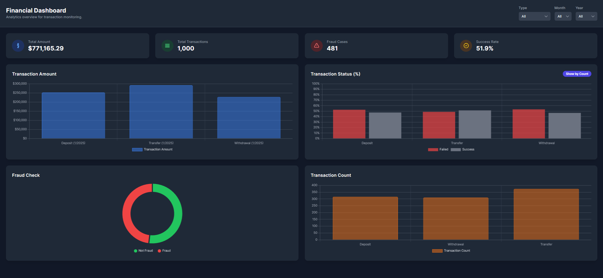

# Financial Analytics Dashboard



A comprehensive financial monitoring system featuring an ETL pipeline and interactive dashboard for transaction analysis.

## ✨ Features

### Data Pipeline
- **Automated ETL**: Daily extraction from multiple sources
- **Data Validation**: Quality checks at each stage
- **Fraud Detection**: Flag suspicious transactions
- **Aggregation**: Pre-calculated metrics for dashboard

### Dashboard
- **Interactive Visualizations**: 
  - Transaction trends
  - Status distribution  
  - Fraud analysis
- **Dynamic Filtering**: By date, type, and status
- **KPI Monitoring**: Real-time metrics
- **Dark/Light Mode**: User preference support

## 🛠️ Technologies

### Backend
| Component       | Technology |
|----------------|------------|
| ETL Orchestration | Apache Airflow |
| Data Processing | Python (Pandas, NumPy) |
| Database       | PostgreSQL |
| API            | Django REST Framework |

### Frontend
| Component       | Technology |
|----------------|------------|
| UI Framework   | HTML5, CSS3, JavaScript |
| Visualization  | Chart.js |
| Styling        | Tailwind CSS |
| Fonts          | Inter |

## 🚀 Installation

### Prerequisites
- Python 3.8+
- Node.js 14+
- PostgreSQL 12+
- Airflow 2.3+

### Backend Setup
```bash
# Clone repository
git clone https://github.com/yourusername/financial-dashboard.git
cd financial-dashboard

# Set up virtual environment
python -m venv venv
source venv/bin/activate  # Windows: venv\Scripts\activate

# Install dependencies
pip install -r requirements.txt

# Configure Airflow
airflow db init
airflow users create \
    --username admin \
    --firstname Admin \
    --lastname User \
    --role Admin \
    --email admin@example.com

# Start services
airflow webserver -D
airflow scheduler -D


graph TD
    A[Payment Processors] --> B(Extract)
    B --> C[Raw Data]
    C --> D(Transform)
    D --> E[Cleaned Data]
    E --> F(Load)
    F --> G[(Data Warehouse)]
    G --> H[Dashboard]

financial-analytics/
├── airflow/               # ETL pipelines
│   ├── dags/             # Airflow DAGs
│   ├── plugins/          # Custom operators
│   └── data/             # Processing scripts
├── dashboard/            # Frontend
│   ├── public/           # Static assets
│   └── src/              # Application code
├── backend/              # Django API
│   ├── core/             # Main app
│   └── manage.py
└── README.md
